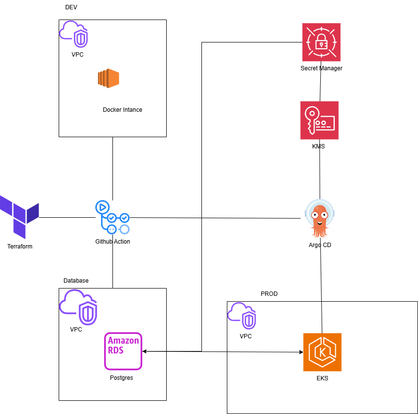
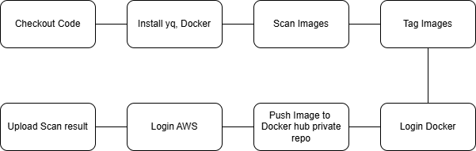
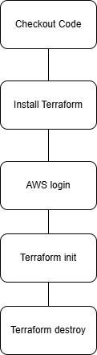

# OPSWAT DevOps Trainee Project

## Sumary

The project includes:

- Continuous deploy microservice aplications to AWS by using Github Action intergrate with Argo CD
- Make application secure by images scanning with Trivy
- Manage infrastructure by Terraform
- Monitoring system by Cloudwatch and Grafana

## Architecture

### System architecture



### CI/CD pineline

- Scan images by Trivy



- Deploy DEV environment


- Destroy DEV environment



- Deploy Production environment


## Component description

### Amazon Web Service

- EC2 instance: Use to run Docker Compose for Dev environment
- EKS cluster:
    Run ArgoCD for build Production environment
    Run production applications
    Use ksops to dencrypt secrets which was encrypted by KMS
- AWS KMS: Use to encrypt and decrypt secrets
- Secret Manager: Use to store application secrets
- RDS Postgres database: store application data

3. Monitoring system

- Grafana: monitor application and infrastructure

### CI/CD pipeline

- Github Action: run workflows to build applications and infrastructure
- ArgoCD: Automate build production application

### Monitoring System

- Grafana: monitor application and infrastructure

## Homepage application


## User guideline

### Prepare

- Create KMS key
- Create ArgoCD on EKS cluster

```bash
Cd terraform/workspaces/argo
terraform init
terraform apply -auto-approve
```

### Set up Argo CD server

To set up Argo CD the solution, follow the steps listed [here](./argo-cd/README.md).

### Set up Github Action

To set up Argo CD the solution, follow the steps listed [here](./.github/README.md).

### Monitoring

To set up Grafana the solution, follow the steps listed [here](./monitoring/README.md).